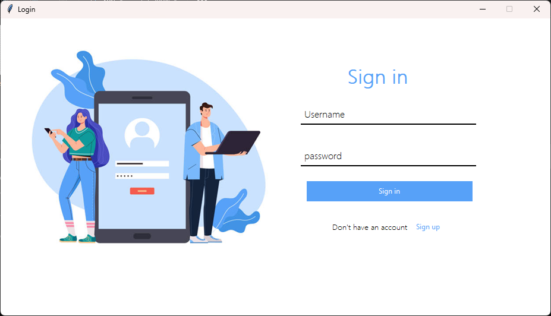
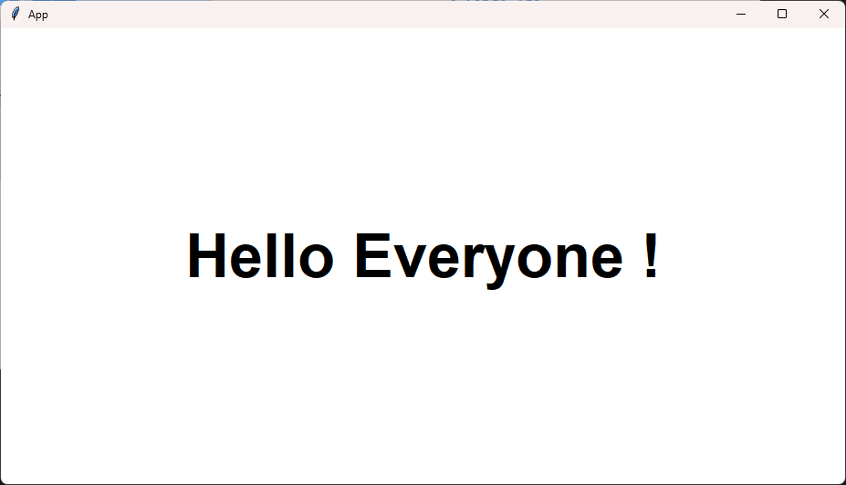
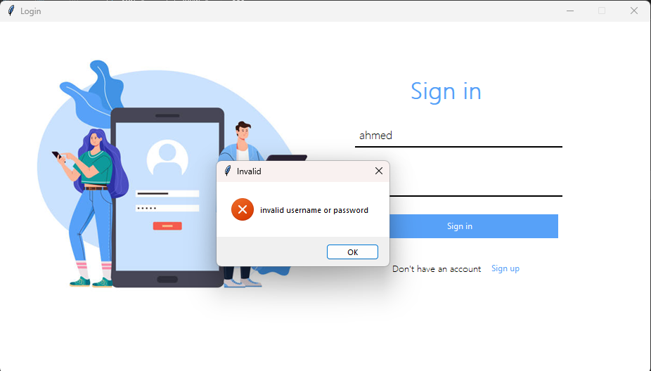
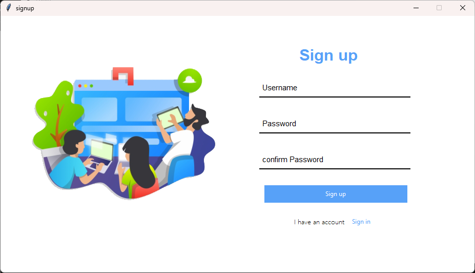
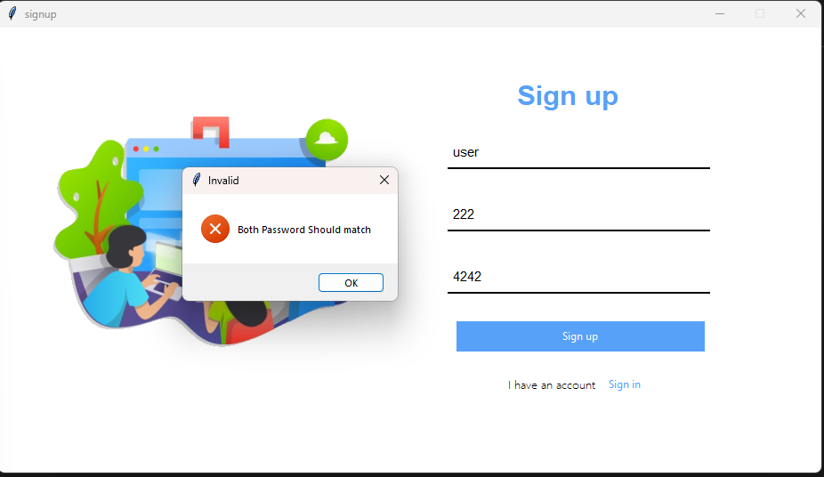

# 🔐 Python Login & Signup System (Tkinter)

A simple **Login & Signup GUI Application** built with **Python (Tkinter)**.  
Users can create accounts and log in with stored credentials. Data is saved locally in a text file.

---

## 🚀 Features

- User **Sign Up** with username & password
- User **Login** authentication
- Data stored in `datasheet.txt` (using dictionary format)
- GUI built with **Tkinter**
- Error handling for invalid logins and password mismatch

---

## 📂 Project Structure
```sh
login
├── images
│   ├── exist-user.png
│   ├── invalid-user.png
│   ├── login.png
│   ├── password-not-match.png
│   ├── sign-in-page.png
│   ├── sign-up-page.png
│   └── signup.png
└── LogInPage.py

```

---

## 🖼️ Demo

### 1. Sign In Page


### 2. Existing User


### 3. Invalid User


### 4. Sign Up Page


### 5. Password Mismatch


---


## ⚙️ How to Run

1. Clone the repo:

   ```sh
   git clone https://github.com/username/Python-Login-System.git
   cd Python-Login-System
   ```

2. Run the app:

   ```sh
   python login.py
   ```

---

## 🛠️ Tech Stack

- Python
- Tkinter (for GUI)
- AST (for safe string-to-dict conversion)

---

## 📌 Notes

- All user credentials are stored in plain text (`datasheet.txt`).
- For production apps, consider using **hashed passwords** and a real database.

---
